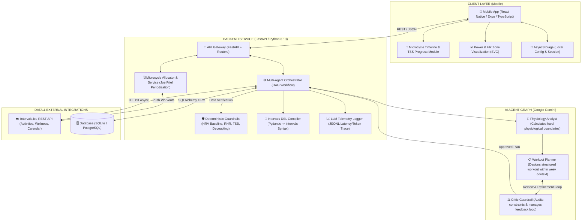

# KowalskiCoach AI

[](https://github.com/)
[](https://www.python.org/)
[](https://fastapi.tiangolo.com/)
[](https://reactnative.dev/)
[](https://www.typescriptlang.org/)
[](https://pytest.org/)
[](./LICENSE)

An intelligent decision-support training system for endurance athletes (cycling, running, triathlon). The application aggregates biometrics and workout history from **Intervals.icu**, executes deterministic physiological analysis via Python rules (AI Guardrails), and orchestrates a multi-agent Directed Acyclic Graph (DAG) powered by **Google Gemini (3.6 Flash)** with Pydantic v2 Structured Outputs for training plan revisions, microcycle periodization, and deterministic compilation into **Intervals.icu Workout DSL**.

---

## 🏗️ System Architecture



---

## ⚙️ Core Modules & Domain Logic

### 1. Deterministic Health Guardrails (`wellness_evaluator.py`)
LLM agents cannot make unconstrained intensity decisions. Pure Python rules enforce strict safety thresholds:
* **HRV 30-Day Rolling Baseline**: Calculates a 30-day moving average and standard deviation ($SD$). An HRV drop $> 15\%$ or below $\text{Baseline} - 1.0 \times SD$ (when drop $\ge 8\%$) triggers an immediate deterministic `CANCEL` override (mandatory rest).
* **Resting Heart Rate (RHR) Dynamics**: An elevation of $\ge 5 \text{ bpm}$ above historical baseline forces a workout modification or session cancellation.
* **Fatigue Index (TSB)**: Values of $TSB < -25$ are classified as acute overreaching/overtraining risks.

### 2. Periodization & Microcycle Allocator (`microcycle_allocator.py` & `microcycle_service.py`)
Deterministic weekly planning algorithm based on **Joe Friel's** endurance methodology:
* **Hard / Easy Rule**: High-intensity workouts (VO2max, SweetSpot, Threshold) are automatically separated by active recovery ($Z1$) or complete rest days ($0\text{ TSS}$).
* **Availability Constraints**: Adapts to the athlete's daily available time (e.g., 0h on Mondays strictly enforces a rest day).
* **Macrocycle Phase Alignment**: Dynamically scales training load (e.g., *Build* prioritizes threshold work, while *Taper* cuts volume by $\sim 40\%$).
* **Intervals.icu Calendar Sync**: Directly exports structured workouts tagged with `[Kowalski]`.

### 3. Pydantic to Intervals DSL Compiler (`workout_compiler.py`)
Deterministically translates validated Pydantic `StructuredWorkout` schemas into syntax-compliant Intervals.icu Workout DSL:
```text
3x
  - 10m Z4 Threshold
  - 5m 50% Recovery
```

### 4. Multi-Agent DAG Loop (`agent_graph/`)
Implements a *Planner <-> Critic Loop* orchestrated across 3 specialized agents:
1. **Physiology Analyst** – Evaluates biometric trends and sets hard boundaries (allowed TSS budget and `allowed_zones`).
2. **Workout Planner** – Constructs the workout structure within the microcycle context and prescribed limits.
3. **Critic Guardrail** – An independent validator verifying safety rules, rejecting out-of-boundary proposals and driving corrective iterations (up to 3 attempts).

---

## 🛠️ Tech Stack

* **Backend**: Python 3.13, FastAPI, Pydantic v2 (`ConfigDict`, `BaseSettings`), SQLAlchemy, HTTPX Async.
* **AI Integrations**: Google GenAI SDK (`gemini-3.6-flash`) with Structured Outputs and real-time token streaming.
* **Mobile Frontend**: React Native, Expo 55, TypeScript 5.9, React Native SVG, Lucide Icons.
* **DevOps & Quality**: Docker, Docker Compose, GitHub Actions CI, Pytest + Pytest-Asyncio.

---

## 🔌 Main API Endpoints

| Endpoint | Method | Description |
| :--- | :--- | :--- |
| `/setup-keys` | `POST` | Configures athlete credentials & Intervals.icu integration |
| `/analyze` | `POST` | Full analysis of athlete profile, SOTA passport & snapshot generation |
| `/atp` | `POST` | Generates Annual Training Plan (ATP / Macrocycle) |
| `/goals` | `POST` / `DELETE` | Manages target races and athletic goals |
| `/evaluate-goal/{id}` | `POST` | Evaluates goal feasibility (Ambitious / Realistic / Safe scenarios) |
| `/plan/{user_id}` | `GET` | Retrieves active plan, microcycles, and upcoming workouts |
| `/plan/microcycle/generate` | `POST` | Generates an AI-assisted microcycle based on ATP and target goals |
| `/plan/microcycle/{id}` | `GET` | Microcycle details and planned TSS breakdown |
| `/plan/microcycle/{id}/sync-intervals` | `POST` | Synchronizes microcycle workouts to Intervals.icu calendar |
| `/plan/workout` | `POST` | Adds a manual/AI-generated workout (auto-compiles to DSL) |
| `/plan/workout/{id}` | `PUT` / `DELETE` | Updates or removes a scheduled workout |
| `/revision/approve/{id}` | `POST` | Approves an AI-suggested workout revision |
| `/chat/stream` | `POST` | Real-time streaming conversational assistant |

---

## 🚀 Getting Started

### Option A: Docker Compose (Recommended)

1. Create `backend/.env` based on `backend/.env.example`:
   ```env
   GEMINI_API_KEY=your_gemini_api_key
   DATABASE_URL=sqlite:///./users.db
   ```
2. Start the container:
   ```bash
   docker compose up --build
   ```
   The FastAPI server will be available at `http://localhost:8000` (Swagger UI at `http://localhost:8000/docs`).

---

### Option B: Local Setup

#### 1. Backend (FastAPI)
```bash
# Navigate to backend directory
cd backend

# Create and activate virtual environment
python -m venv venv

# On Windows (PowerShell):
.\venv\Scripts\Activate.ps1
# On Linux / macOS:
source venv/bin/activate

# Install dependencies
pip install -r requirements.txt

# Configure environment variables
cp .env.example .env

# Run FastAPI server with auto-reload
uvicorn app.main:app --reload --port 8000
```

#### 2. Automated Tests (Pytest)
```bash
# Run the complete test suite (62 tests)
pytest -v
```
*(With `pytest.ini` configured, tests can also be executed directly from the project root directory: `pytest -v`)*

#### 3. Mobile App (React Native / Expo)
```bash
# Navigate to mobile directory
cd mobile

# Install dependencies
npm install

# Configure environment (optional, defaults to localhost:8000)
cp .env.example .env

# Start Expo development server
npm run start
```
* To run in web browser: press `w` or run `npm run web`.
* To run on a physical device: scan the QR code using the **Expo Go** app.

---

## 📄 License

This project is distributed under the [Portfolio & Recruitment Review License](./LICENSE) – provided solely for technical evaluation and portfolio review purposes.
